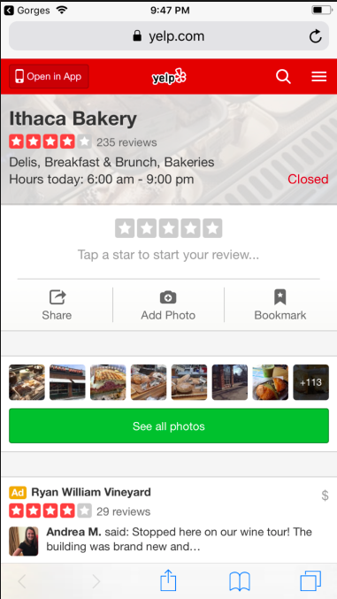

# Gorges
An app that searches and displays restaurants in Ithaca

Often, visitors to Ithaca will have trouble finding restaurants. Our app has a search feature, where users can search restaurants in Ithaca by name. The app also lists ratings, price range, address, and phone number for convenience. It also links the user to the corresponding Yelp website, for additional information. 

iOS:
Autolayout is utilized in our design, to specify the locations of buttons, labels, and information.
TableView is used to display the restaurants that are search results.
NavigationController is used to implement our multiple views (The initial background, the search results, and the detail view) The UIButton on the background page (named Restaurants), allows navigation into the search view, for instance. 
An API is incorporated to give information on the restaurants.

Backend :

We created a wrapper that made accessing Yelp api simpler. We shortened the url so that it's not necessary to pass in any parameters.

Some screenshots of our app

